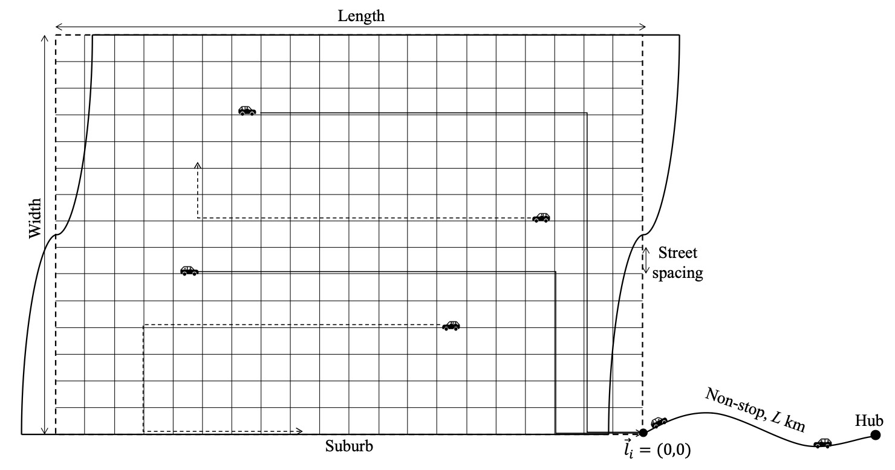

## RPaF service description

We adopt the RPaF concept from (Fan et al., 2024), which connects a remote suburb and a downtown hub, as illustrated in Figure 1. Similar layouts have been used in previous studies to study feeder transit systems, e.g., Kim et al. (2019); Kim and Schonfeld (2013). We use this single-hub system to ensure comparability with prior research. In cases of networks with multiple hubs, the proposed models can be utilized to operate separate RPaF services for each hub.

As shown in Figure 1, we first represent the suburb as a rectangular suburban region with an evenly spaced grid street network. Later, we will apply the simulation framework to a case study using the real-world street network and demand data.

We aim to examine a stabilized system, where the roadway network is configured with the following traffic characteristics. The cruising speed of RPaF vehicles is $S'$ [km/h] on suburban streets and $S$ [km/h] on freeways. At intersections, RPaF vehicles experience delays dependent on control rules such as no control and signalized controls. In addition, vehicles incur a fixed delay for each stop to pick up or drop off. To enhance simulation efficiency, we disregard the dynamics of background traffic, which may have a minor impact in suburban areas. The simulation of dynamic traffic could be integrated into our framework as a potential future research direction.

The travel demand between the suburb and the hub is bidirectional, denoted $\lambda_{\rm OB}$ [patrons/sq. km/hour] for outbound trips (from residences in the suburb to the hub) and $\lambda_{\rm IB}$ [patrons/sq. km/hour] inbound trips (from the hub to the suburb). We assume for now that travelers' origins and destinations are uniformly distributed throughout the suburban area.

We will examine a single RPaF operator who oversees a fleet of e-hailing vehicles with fully compliant drivers. This operator could be a TNC, a transit agency, or a third-party integrator that combines services from various providers onto a unified platform.

## Simulation framework

The simulation framework contains three simulation modules for the operator, patrons, and vehicles. We utilize Simulation of Urban MObility (SUMO) as the tool to develop a customized time-based simulation environment for RPaF services. SUMO is an open-source microscopic simulation software widely used in transportation studies (Huang et al., 2021; Zhu et al., 2020). Specifically, we use the Traci (Traffic Control Interface) of SUMO to manipulate the actions of simulated entities, i.e., the operator, patrons, and vehicles. Accordingly, we devise three interactive modules, as shown in Figure \ref{fig:sti-frame}, which are described in the following subsections.

